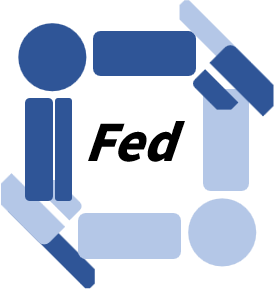

<div align="center">
  
<h1>Federated Embodied Learning</h1>

</div>

This repo implement several robot arm manipulation tasks in simulation in a federated manner. It supports several common cases including homogeneous-embodiment collaboration, cross-embodiment collaboration across different tasks and data collectors.

## Installation
- pytorch
Please intall pytorch following the guidence in the pytorch's offsite [link](https://pytorch.org)

- Other
```shell
pip install flgo
pip install robosuite==1.5.1
pip install robomimic==0.4.0
# install mimicgen
git clone https://github.com/NVlabs/mimicgen.git 
cd mimicgen
pip install -e .
pip install mujoco==2.3.2
```

## Characteristic
| Task Name | Cross-Collector                         | Cross-Embodiment          | Scale  | 
|-----------|-----------------------------------------|---------------------------|--------| 
| CE_SquareD0_lowdim_bcrnn       | ✔                                       | ✔                 | Small  |
| CE_SquareD1_lowdim_bcrnn    | ✔ | ✔              | Small  |
| CE_ThreadingD0_lowdim_bcrnn    | ✔ | ✔ | Small  |
| CE_ThreadingD1_lowdim_bcrnn  | ✔ | ✔           | Small  |
| Panda_Lift_lowdim_bcrnn  | ✔ |               | Small  |
|Panda_NutAssemblySquare_lowdim_bcrnn|      ✔                         |                           | Small  |
|Panda_PickPlaceCan_lowdim_bcrnn|      ✔                            |                           | Small  |
|Panda_ToolHang_lowdim_bcrnn|                                         |                           | Medium |
|Panda_TwoArmTransport_lowdim_bcrnn|      ✔                          |                           | Small  |

## Data Preparation
### Robomimic
Download the dataset from huggingface [link](https://huggingface.co/datasets/amandlek/robomimic) into `data`. The architecture of the data should be organized like
```
data
├─ robomimic
│  ├─ can                   
│  ├─ ...
│  └─ square   					 
│     ├─ mh                     
│     │  ├─ low_dim_v15.hdf5          
│     │  └─ demo_v15.hdf5  
│     └─ ph     
│        ├─ low_dim_v15.hdf5          
│        └─ demo_v15.hdf5   
...
```

### MimicGen
Download the dataset from the huggingface [link](https://huggingface.co/datasets/amandlek/mimicgen_datasets). The architecture should be organized as:
```
data
├─ mimicgen
│  ├─ core
│  ├─ ...
│  └─ robot   					 
│     ├─ square_d0_iiwa.hdf5                     
│     ...         
...
```

## Run
### Local Only

```shell
python run_local.py --task TASK_NAME
```
### Federated Learning

```shell
python run_fl.py --task TASK_NAME --method ALGO_NAME
```
# Evaluate
To evaluate the task success rate for each trained model, please run the following script
```shell
python scripts/evaluate.py --task TASK_NAME --env_name ENV_NAME --robot ROBOT_NAME --ckpt CHECKPOINT_PATH
```

# Acknowledgement
This repo is based on the open-source repos below
- [Robosuite](https://robosuite.ai/)
- [Robomimic](https://robomimic.github.io/)
- [MimicGen](https://github.com/NVlabs/mimicgen)
